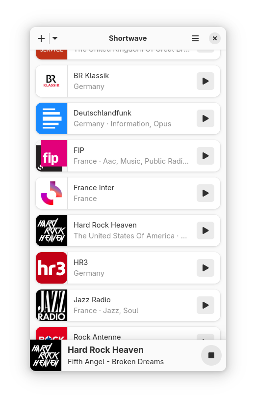
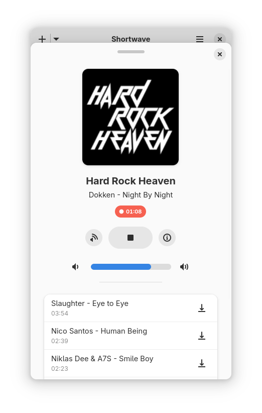

<div align=center>


<h3>Animawave is an internet radio player that provides access to a station database with over 50,000 stations carefully selected for you by AI </h3>

## Getting in Touch
If you have any questions regarding the use or development of Animawave,
want to discuss design or simply hang out, please join us on our [#animawave:gnome.org](https://matrix.to/#/#animawave:gnome.org) matrix room.

## Installation
The recommended way of installing Animawave is using the Flatpak package. If you don't have Flatpak installed yet, you can get it from [here](https://flatpak.org/setup/). You can install stable builds of Animawave from Flathub by using this command:

`flatpak install https://flathub.org/repo/appstream/de.haeckerfelix.Animawave.flatpakref`

Or by clicking this button:

<a href="https://flathub.org/apps/details/de.haeckerfelix.Animawave"></a>

#### Nightly Builds

Development builds of Animawave are available from the `gnome-nightly` Flatpak repository: 

```
flatpak remote-add --if-not-exists gnome-nightly https://nightly.gnome.org/gnome-nightly.flatpakrepo
flatpak install gnome-nightly de.haeckerfelix.Animawave.Devel
```

## FAQ
- **Why is it called 'Animawave'?**

    Animawave combines "Anima" (Latin for soul/life) with "wave" (as in radio waves), representing the vitality and energy of internet radio broadcasting.

    If you want to know more about the naming process, you should read this [blog post](https://blogs.gnome.org/tbernard/2019/04/26/naming-your-app/)

- **Why I cannot edit stations anymore?**

    The edit feature is disabled because of vandalism. I cannot change this. [More information here](http://www.radio-browser.info/gui/#/) and [here](https://github.com/segler-alex/radiobrowser-api/issues/39).

- **Is Animawave compatible with Linux phones?**

    Yes! We use the awesome [libadwaita](https://gitlab.gnome.org/GNOME/libadwaita) library to make the interface adaptive. The easiest way to get it on your phone is using the Flatpak package. [Flathub](https://flathub.org/apps/details/de.haeckerfelix.Animawave) provides aarch64 packages.




- **Which database does Animawave use?**

    [radio-browser.info](http://www.radio-browser.info/gui/#/). It's a community database, everybody can contribute information.
    
- **How I can get debug information?**

    Run Animawave using `RUST_BACKTRACE=1 RUST_LOG=animawave=debug flatpak run de.haeckerfelix.Animawave` (`.Devel`).

## Translations
Translation of this project takes place on the GNOME translation platform,
[Damned Lies](https://l10n.gnome.org/module/animawave). For further
information on how to join a language team, or even to create one, please see
[GNOME Translation Project wiki page](https://wiki.gnome.org/TranslationProject).

## Building
### Building with Flatpak + GNOME Builder
To build the development version of Animawave and hack on the code see the
[general guide](https://welcome.gnome.org/app/Animawave/#getting-the-app-to-build) for
building GNOME apps with Flatpak and GNOME Builder.

### Building it manually
1. `git clone https://gitlab.gnome.org/World/Animawave.git`
2. `cd Animawave`
3. `meson --prefix=/usr build`
4. `ninja -C build`
5. `sudo ninja -C build install`

To learn more about the required dependencies, please check the [Flatpak manifest](build-aux/de.haeckerfelix.Animawave.Devel.json).

## Code Of Conduct
We follow the [GNOME Code of Conduct](https://conduct.gnome.org/). All
communications in project spaces are expected to follow it.
